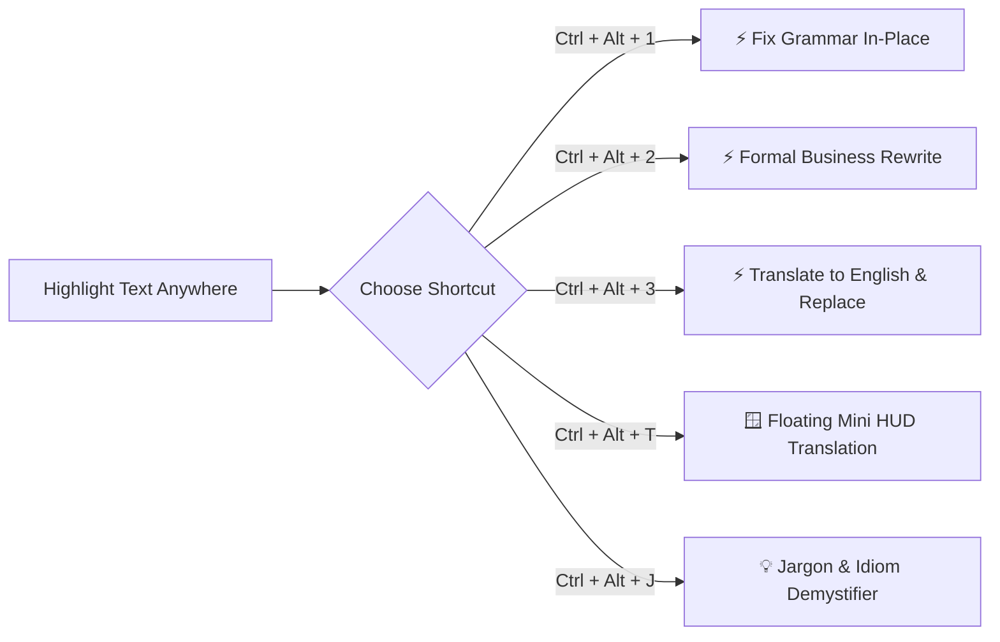

<div align="center">

# ⚡ Gemini AI Text & Translation Assistant

**The ultra-fast desktop AI assistant that rewrites text, fixes grammar, demystifies slang, and translates in-place across any Windows application.**

[](https://github.com/pkoryaka/gemini-desktop-translator)
[](https://aistudio.google.com/)
[](./LICENSE)
[](https://github.com/pkoryaka/gemini-desktop-translator)
[](https://github.com/pkoryaka/gemini-desktop-translator)

<p align="center">
  <a href="#-quick-start">🚀 Quick Start</a> •
  <a href="#-core-capabilities">✨ Core Capabilities</a> •
  <a href="#-why-this-beats-other-tools">📊 Comparison</a> •
  <a href="#-custom-prompt-actions">⚡ In-Place Actions</a> •
  <a href="#-license--commercial-terms">📜 License</a>
</p>

</div>

---

## 🎯 What is it?

Tired of copying text, switching to browser tabs, pasting into ChatGPT, and copying the answer back?

**Gemini AI Text & Translation Assistant** runs quietly in your Windows system tray and hooks directly into your global keystrokes. Highlight text in **any software** (Slack, Word, Visual Studio Code, Chrome, Outlook, Telegram, Discord, Notepad) and press a shortcut:

* **⚡ Need a grammar fix?** Press `Ctrl + Alt + 1` &rarr; Instant correction replaces your text in-place.
* **⚡ Need a professional tone?** Press `Ctrl + Alt + 2` &rarr; Rewritten in executive corporate phrasing in-place.
* **⚡ Need English translation?** Press `Ctrl + Alt + 3` &rarr; Replaced with fluent English in-place.
* **⚡ Need deep translation & slang breakdown?** Press `Ctrl + Alt + T` or `Ctrl + Alt + J` &rarr; Instant floating glassmorphic HUD appears at your mouse cursor.

---

## ✨ Core Capabilities



### 1. ⚡ In-Place AI Rewriting (No Window Needed)
Highlight text and trigger custom prompt actions. The text is captured in `<15ms`, sent to Google Gemini via keep-alive streaming sockets, and **pasted directly back into your active cursor position**.

### 2. 💡 Jargon Demystifier & Plain Language Breakdown
Translating idioms, metaphors, or corporate slang literally ruins context. The Jargon Explainer breaks down:
* What the speaker **literally said** vs **what they actually meant**.
* Detailed breakdown table of slang, idioms, acronyms, and cultural nuances.
* Detected emotion, sentiment, and interpersonal tone.

### 3. 🪟 Cursor-Following Floating Mini HUD
* Positioned smoothly next to your mouse cursor across multi-monitor setups.
* Sub-150ms Time-To-First-Token (TTFT) Server-Sent Events (SSE) streaming.
* Built-in **Text-to-Speech (TTS)** playback, **1-click Copy**, and **Full Window Expand (↗️)**.

### 4. 🌐 Multilingual Powerhouse
Bidirectional fluency across **Ukrainian (Українська)**, **English**, **Spanish (Español)**, and **Russian (Русский)** with auto-language detection.

### 5. 🚀 Ultra-Fast Native Windows Integration
* **Sub-15ms Win32 Capture**: Custom compiled C# Win32 keystroke synthesizer (`CopyNative.exe`) without polluting clipboard history.
* **Zero-Logon Delay**: Starts silently directly into the system tray at Windows logon in `<100ms` without popup windows or consoles.

---

## 📊 Why This Beats Other Tools

| Feature | **Gemini AI Assistant** | **DeepL Desktop** | **Raycast AI** | **ChatGPT Web Tab** |
| :--- | :---: | :---: | :---: | :---: |
| **In-Place Replace (Paste-Back)** | ✅ **Yes (<150ms)** | ❌ No (Popup only) | ✅ Yes (Mac only) | ❌ No (Tab switching) |
| **Windows 10 / 11 Native** | ✅ **Yes** | ✅ Yes | ❌ Mac Only | ❌ Web only |
| **Jargon & Idiom Breakdown** | ✅ **Yes** | ❌ No | ❌ Manual prompt | ❌ Manual prompt |
| **Custom Prompt Slots with Hotkeys** | ✅ **3 Slots Editable** | ❌ No | ⚠️ Paid Pro Plan | ❌ No |
| **API Cost** | 🆓 **Free Tier (Google AI)** | 💲 Paid Subscription | 💲 Paid Subscription | 💲 Paid / Web Limit |
| **Privacy & Telemetry** | 🔒 **100% Local API Key** | ⚠️ Cloud telemetry | ⚠️ Cloud telemetry | ⚠️ Cloud history |

---

## 🚀 Quick Start (Under 2 Minutes)

### Prerequisites
* Windows 10 or Windows 11
* Node.js 18+ (for building/running from source)
* A Free Google Gemini API Key from [Google AI Studio](https://aistudio.google.com/app/apikey)

### Installation & Launch

1. **Clone the Repository:**
   ```bash
   git clone https://github.com/pkoryaka/gemini-desktop-translator.git
   cd gemini-desktop-translator
   ```

2. **Install Dependencies & Build:**
   ```bash
   npm install
   npm run build
   ```

3. **Launch the Desktop Assistant:**
   ```bash
   npm start
   ```
   *(Or double-click [`launch.vbs`](file:///c:/AI%20Projects/Personal/Translation/launch.vbs) for instant silent background startup directly into your system tray!)*

4. **Enter Your Gemini API Key:**
   * Open the app, click **Settings ⚙️**, paste your free Google Gemini API Key, and hit **Save**.

---

## ⌨️ Default Global Shortcuts

| Shortcut | Action | Destination |
| :--- | :--- | :--- |
| `Ctrl + Alt + 1` | **Fix Grammar & Polish** | ⚡ In-Place Selection Replacement |
| `Ctrl + Alt + 2` | **Professional Business Tone** | ⚡ In-Place Selection Replacement |
| `Ctrl + Alt + 3` | **Translate to English & Replace** | ⚡ In-Place Selection Replacement |
| `Ctrl + Alt + T` | **Quick Translate** | 🪟 Floating Mini HUD |
| `Ctrl + Alt + J` | **Translate & Explain Jargon** | 🪟 Floating Mini HUD with Jargon Pills |

*(All hotkeys and prompt actions are 100% customizable in Settings with automatic conflict detection).*

---

## 🔒 Privacy & Security

* **Direct API Connection**: Requests are sent straight from your local device to Google's official Gemini endpoint.
* **No Middleware Servers**: No intermediary proxy, tracking server, or analytics collection.
* **Local Storage**: Your API key and history remain encrypted/stored exclusively on your local machine.

---

## 📜 License & Commercial Terms

This software is distributed under a **Dual-Use License**:

* **🟢 Personal, Educational & Non-Commercial Use:** **100% Free of charge** for individual personal productivity and learning.
* **🏢 Commercial & Enterprise Use:** Any deployment or use within commercial companies, businesses, or revenue-generating organizations requires a valid **Commercial License** after a 30-day evaluation period.

See the full terms in the [`LICENSE`](./LICENSE) file. For commercial licensing inquiries, please open an issue or contact the maintainer via GitHub.

---

<div align="center">
  <sub>Built with ❤️ using React 19, Vite, Electron, and Google Gemini.</sub>
</div>

