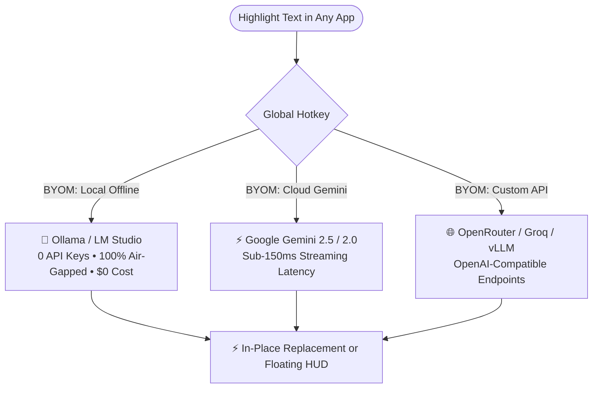

<div align="center">

# ⚡ Gemini AI Clipboard Assistant
### *With Full BYOM (Bring Your Own Model) & Local Offline AI Support*

**The ultra-fast desktop clipboard AI that rewrites text in-place, fixes grammar, demystifies slang, and translates across any Windows application — powered by Google Gemini or 100% offline local LLMs.**

[](https://github.com/pkoryaka/gemini-desktop-translator)
[](https://aistudio.google.com/)
[](https://ollama.com/)
[](./LICENSE)
[](https://github.com/pkoryaka/gemini-desktop-translator)

<p align="center">
  <a href="#-why-byom-bring-your-own-model">🧠 BYOM Engine</a> •
  <a href="#-core-capabilities">✨ Core Capabilities</a> •
  <a href="#-why-this-beats-other-tools">📊 Comparison</a> •
  <a href="#-quick-start">🚀 Quick Start</a> •
  <a href="#-custom-prompt-actions">⚡ In-Place Actions</a> •
  <a href="#-license--commercial-terms">📜 License</a>
</p>

</div>

---

## 🎯 What is it?

Tired of copying text, switching browser tabs, pasting into ChatGPT or DeepL, copying the answer, and switching back?

**Gemini AI Clipboard Assistant** lives quietly in your Windows system tray and hooks directly into your global keystrokes. Highlight text in **any software** (Slack, Microsoft Word, Visual Studio Code, Chrome, Outlook, Telegram, Discord, Notion, Notepad) and press a shortcut:

* **⚡ Need a grammar fix?** Press `Ctrl + Alt + 1` &rarr; Instant correction replaces your text in-place.
* **⚡ Need a professional tone?** Press `Ctrl + Alt + 2` &rarr; Rewritten in executive corporate phrasing in-place.
* **⚡ Need English translation?** Press `Ctrl + Alt + 3` &rarr; Replaced with fluent English in-place.
* **⚡ Need deep translation & slang breakdown?** Press `Ctrl + Alt + T` or `Ctrl + Alt + J` &rarr; Instant floating glassmorphic HUD appears right at your mouse cursor.

---

## 🧠 Why BYOM (Bring Your Own Model)?

Workplaces, enterprise policies, and privacy-conscious users often cannot send sensitive code, legal documents, or private chats to cloud APIs. **Gemini AI Clipboard Assistant solves this with native BYOM support:**



### 1. 🦙 100% Offline Local LLMs (Ollama & LM Studio)
* **Zero API Keys Required**: Plug-and-play with your existing Ollama or LM Studio installation.
* **Total Air-Gapped Privacy**: No data leaves your machine. Perfect for confidential corporate codebases, legal documents, medical data, and offline travel.
* **Presets Included**: 1-click configuration for `Ollama (localhost:11434)` and `LM Studio (localhost:1234)`.
* Run any model: `llama3.2`, `mistral`, `deepseek-r1`, `qwen2.5`, `phi-4`, etc.

### 2. ⚡ Google Gemini Cloud Powerhouse
* Blazing fast sub-150ms Time-to-First-Token (TTFT).
* Supports official `gemini-2.0-flash`, `gemini-2.5-flash`, `gemini-2.5-pro`, and experimental models.
* Free tier available via Google AI Studio with high rate limits.

### 3. 🌐 OpenAI-Compatible Endpoints
* Point the assistant to **OpenRouter**, **Groq**, **DeepSeek**, **Together AI**, or internal corporate LLM gateways.
* Test your endpoint with one click right from the Settings panel.

---

## ✨ Core Capabilities

### 1. ⚡ In-Place AI Rewriting (No Window Needed)
Highlight text and trigger custom prompt actions. The text is captured in `<15ms`, processed through your chosen model, and **pasted directly back into your active cursor position**.

### 2. 💡 Jargon Demystifier & Plain Language Breakdown
Translating idioms, metaphors, or corporate slang literally ruins context. The Jargon Explainer breaks down:
* What the speaker **literally said** vs **what they actually meant**.
* Detailed breakdown table of slang, idioms, acronyms, and cultural nuances.
* Detected emotion, sentiment, and interpersonal tone.

### 3. 🪟 Cursor-Following Floating Mini HUD
* Positioned smoothly next to your mouse cursor across multi-monitor setups.
* Sub-150ms streaming response.
* Built-in **Text-to-Speech (TTS)** playback, **1-click Copy**, and **Full Window Expand (↗️)**.

### 4. 🌐 Multilingual Fluency
Bidirectional fluency across **Ukrainian (Українська)**, **English**, **Spanish (Español)**, and **Russian (Русский)** with auto-language detection.

### 5. 🚀 Ultra-Fast Native Windows Integration
* **Sub-15ms Win32 Keystroke Synthesizer**: Custom compiled C# Win32 keystroke engine (`CopyNative.exe`) without polluting clipboard history.
* **Zero-Logon Delay**: Starts silently directly into the system tray at Windows logon in `<100ms` without popup windows or consoles.

---

## 📊 Why This Beats Other Tools

| Feature | **Gemini AI Clipboard Assistant** | **DeepL Desktop** | **Raycast AI** | **ChatGPT Web Tab** |
| :--- | :---: | :---: | :---: | :---: |
| **Bring Your Own Model (BYOM)** | ✅ **Yes (Ollama, LM Studio, Custom)** | ❌ No | ⚠️ Proprietary only | ❌ No |
| **100% Offline / Air-Gapped Mode** | ✅ **Yes (via Local LLM)** | ❌ No | ❌ No | ❌ No |
| **In-Place Replace (Paste-Back)** | ✅ **Yes (<150ms)** | ❌ No (Popup only) | ✅ Yes (Mac only) | ❌ No (Tab switching) |
| **Windows 10 / 11 Native** | ✅ **Yes** | ✅ Yes | ❌ Mac Only | ❌ Web only |
| **Jargon & Idiom Breakdown** | ✅ **Yes** | ❌ No | ❌ Manual prompt | ❌ Manual prompt |
| **Custom Prompt Slots with Hotkeys** | ✅ **3 Hotkey Slots** | ❌ No | ⚠️ Paid Pro Plan | ❌ No |
| **API Cost** | 🆓 **$0 (Local) or Free Tier** | 💲 Paid Subscription | 💲 Paid Subscription | 💲 Paid / Web Limit |
| **Privacy & Telemetry** | 🔒 **100% Local / Zero Cloud Logs** | ⚠️ Cloud telemetry | ⚠️ Cloud telemetry | ⚠️ Cloud history |

---

## 🚀 Quick Start (Under 2 Minutes)

### Prerequisites
* Windows 10 or Windows 11
* Node.js 18+ (for building/running from source)
* **Option A (Cloud)**: A Free Google Gemini API Key from [Google AI Studio](https://aistudio.google.com/app/apikey)
* **Option B (Local/BYOM)**: [Ollama](https://ollama.com/) or [LM Studio](https://lmstudio.ai/) running locally (No API key needed!)

### Installation & Launch

1. **Clone the Repository:**
   ```bash
   git clone https://github.com/pkoryaka/gemini-desktop-translator.git
   cd gemini-desktop-translator
   ```
   *(Note: Repository name on GitHub is `gemini-desktop-translator`)*

2. **Install Dependencies & Build:**
   ```bash
   npm install
   npm run build
   ```

3. **Launch the Desktop Assistant:**
   ```bash
   npm start
   ```
   *(Or double-click [`launch.vbs`](file:///c:/AI%20Projects/Personal/Translation/launch.vbs) for instant silent background startup directly into your system tray!)*

4. **Select Your AI Engine in Settings ⚙️:**
   * **Google Gemini**: Paste your free Gemini API key and select your preferred model.
   * **BYOM / Local AI**: Click the **BYOM (Local AI)** tab, click **Ollama (11434)** or **LM Studio (1234)**, enter your local model (e.g. `llama3.2`), and click **Test Endpoint Connection**.

---

## ⌨️ Default Global Shortcuts

| Shortcut | Action | Destination |
| :--- | :--- | :--- |
| `Ctrl + Alt + 1` | **Fix Grammar & Polish** | ⚡ In-Place Selection Replacement |
| `Ctrl + Alt + 2` | **Professional Business Tone** | ⚡ In-Place Selection Replacement |
| `Ctrl + Alt + 3` | **Translate to English & Replace** | ⚡ In-Place Selection Replacement |
| `Ctrl + Alt + T` | **Quick Translate** | 🪟 Floating Mini HUD |
| `Ctrl + Alt + J` | **Translate & Explain Jargon** | 🪟 Floating Mini HUD with Jargon Pills |

*(All hotkeys and prompt actions are 100% customizable in Settings with automatic conflict detection).*

---

## 🔒 Privacy & Security

* **Local / Air-Gapped Mode**: When using Ollama or LM Studio, 100% of data stays on your local machine. No packets leave your computer.
* **Direct Cloud Connection**: When using Google Gemini or OpenRouter, requests go directly to the provider endpoint without intermediary proxies or tracking servers.
* **Local Storage**: Your API keys and history are stored exclusively on your local machine.

---

## 📜 License & Commercial Terms

This software is distributed under a **Dual-Use License**:

* **🟢 Personal, Educational & Non-Commercial Use:** **100% Free of charge** for individual personal productivity and learning.
* **🏢 Commercial & Enterprise Use:** Any deployment or use within commercial companies, businesses, or revenue-generating organizations requires an authorized **Commercial License** after a 30-day evaluation period.

See the full terms in the [`LICENSE`](./LICENSE) file. For commercial licensing inquiries, please open an issue or contact the maintainer via GitHub.

---

<div align="center">
  <sub>Built with ❤️ using React 19, Vite, Electron, Google Gemini, and Local LLMs (Ollama / LM Studio).</sub>
</div>
